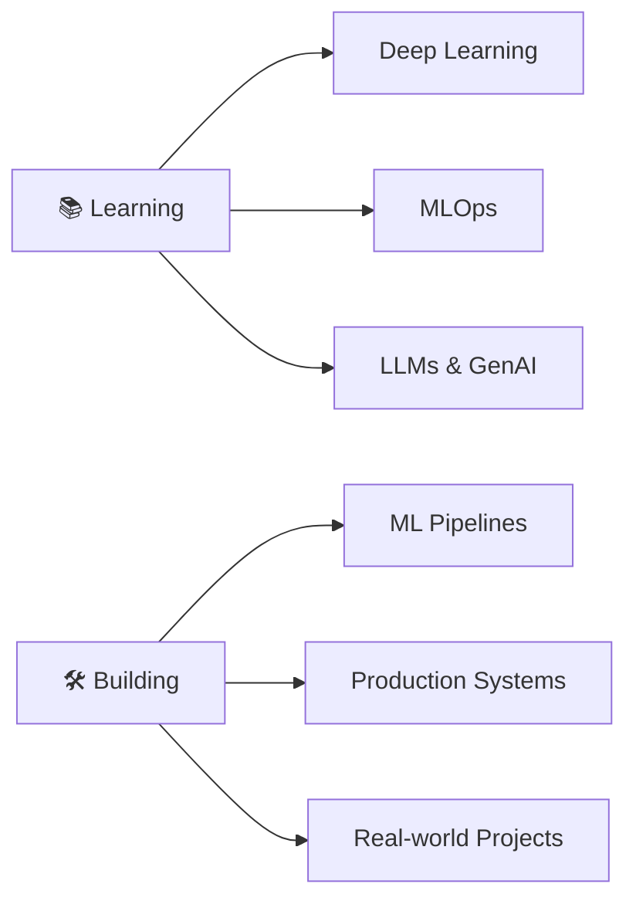

# 👋 Hi, I'm Saumya Jain

### 🚀 Machine Learning Engineer | Data Enthusiast | Building AI Solutions

---

## 💫 About Me

<table>
<tr>
<td width="50%">

### 🎯 What Drives Me
- 🔍 Transforming raw data into actionable insights
- 🧪 Experimenting with ML models and pipelines
- 🏗️ Building production-ready AI solutions
- 📈 Continuous learning through hands-on projects
- 🌍 Contributing to open-source ML community

</td>
<td width="50%">

### 🚀 Currently Exploring
- 🧠 **Deep Learning** architectures
- ⚙️ **MLOps** best practices
- 🤖 **LLMs** and generative AI
- 📊 **Model optimization** techniques
- 🔄 **End-to-end ML** workflows

</td>
</tr>
</table>

> *"Data is the new oil, but models are the refineries. I'm here to build both."*

### 🌟 Core Strengths

| 🐍 Python Expert | 🤖 ML Foundations | 🔄 MLOps | 📊 Data Analysis |
|:---:|:---:|:---:|:---:|
| Clean, production code | Model evaluation & tuning | Pipeline automation | Insights from data |

---

## 🛠️ Tech Arsenal

### Languages & Frameworks

### ML & Data Science

### Databases & Tools

### Deployment

---

## 📊 GitHub Analytics

  
  

  

  

---

## 🔥 Activity Graph

  

---

## 🎯 Current Focus

```mermaid
graph LR
    A[📚 Learning] --> B[Deep Learning]
    A --> C[MLOps]
    A --> D[LLMs & GenAI]
    E[🛠️ Building] --> F[ML Pipelines]
    E --> G[Production Systems]
    E --> H[Real-world Projects]
```

---

## 📫 Let's Connect!

### 💬 Open to collaborations, discussions, and opportunities!

---

### 💡 "The best way to learn is to build, test, and iterate in public"

⭐️ From [Saumyajain0003](https://github.com/Saumyajain0003)

